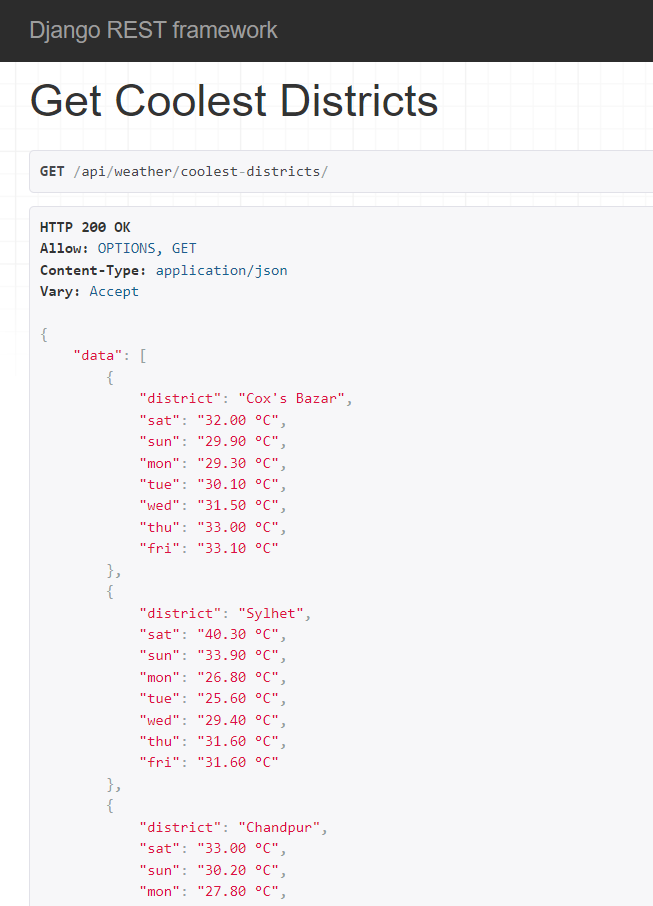
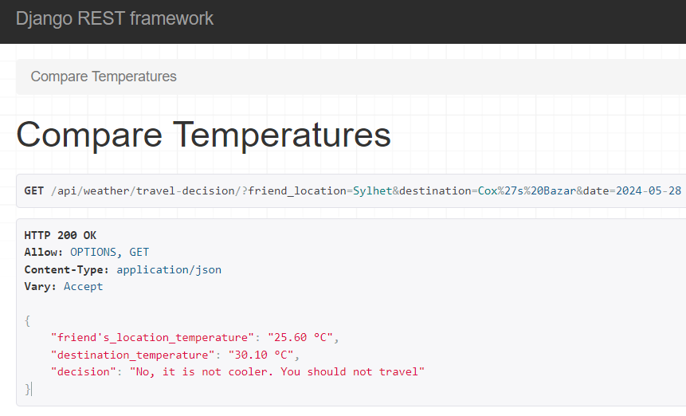

# Weather App

## Description

An application built using Python and Django Rest Framework, designed to weather forecast.

## Requirements

Software

- Python 3+
- Django Rest Framework
- Docker

Style Guide

- [black](https://github.com/psf/black)
- [Flake8](https://flake8.pycqa.org/en/latest/)
- [isort](https://pypi.org/project/isort/)

### Installation and Run the project

follow the below steps

- make virtual environment

  `python -m venv env`

- activate the virtual environment in windows

  `.\env\Scripts\activate`

- activate the virtual environment in linux/mac

  `sourc env_name/bin/activate`

- install the dependency from requirements.txt

  `pip install -r requirements.txt`

- create env file[copy .env.dev.example and make new file name .env.dev]

- after running all the project's dependencies, now we have to run a command to run migration

  `python manage.py migrate`

- after running all the migrations, seed all the district data from github link

  `python manage.py insert_districts`

- finally run the below command to run the project

  `python manage.py runserver`

- Run test

  `python manage.py pytest`

### Or Run with docker-compose

follow the below steps

- create env file [copy .env.dev.example, .env.dev.db.example and make new file name .env.dev and .env.dev.db]
- run docker compose to up and running the application

  `docker-compose up`

- Run test inside docker container

  `docker-compose exec weather_api pytest`

### Sample output

Get 10 most coolest districts

Make decision for your friend will travel or not

